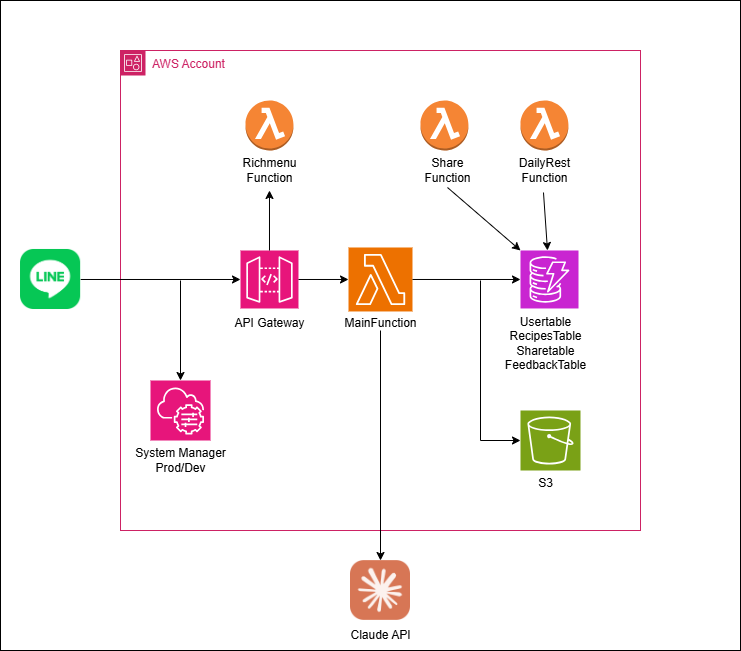

# Cooksnap - LINE Bot x Serverless レシピ提案サービス

## このリポジトリについて

このプロジェクトでは、**インフラ構成・設計判断・Bot のアイデア設計はすべて自分で決定・構築**しました。
一方、フロントエンドの部分（LINE の UI 定義など）は AI ツールを活用しつつ、出力されたコードのエラーや曖昧な部分については自分で検証・修正し、必要に応じて AI に質問するという形で取り組みました。

そのため、このリポジトリでは**構成の意図や運用観点の選定理由**を重視して記載しています。

このリポジトリは、SRE・クラウドインフラエンジニアとしての
設計力・運用視点・自動化・コスト意識 を伝えることを目的とした技術ポートフォリオです。

一人で設計・実装・検証・運用まで完結させた個人開発プロジェクトです。
現在は MVP 段階で、ユーザーの利用動向を見ている、効果検証を進めているフェーズ にあります。

MVP 段階では、AWS 無料枠内で動作することを目指し、
Lambda・SSM・DynamoDB を他の構成に差し替えることで、汎用的な基盤として他プロジェクトにも流用できること考えました。

## プロダクト概要

- 名称：Cooksnap
- 形式：LINE Bot
- 機能：
  - 食材画像を LINE に送信 → Claude AI が食材を識別し、レシピ提案
  - 生成レシピの SNS 共有
  - 紹介コード機能によるユーザー招待・特典
- 目的：冷蔵庫の余り物活用、料理初心者の支援、食品ロス削減、嫁に料理してもらう

詳しくは [architecture/overview.md](architecture/overview.md)

## 技術構成・設計

- インフラ基盤：AWS SAM による IaC 管理(環境分離済み)
- 実行基盤：AWS Lambda（Python）、API Gateway
- データベース：DynamoDB
- ストレージ：S3（食材画像保存）
- 機密管理：SSM Parameter Store（環境ごとに分離）
- 監視：CloudWatch Logs（最小構成）

構成図：

## ディレクトリ構成

```
cooksnap-infra-sam/
├── template.yaml                # AWS SAMによるIaCテンプレート
├── architecture/               # アーキテクチャ設計思想
│   ├── overview.md
│   └── architecture.png
├── ssm/                        # 機密情報・環境分離の戦略
│   └── parameter_model.md
├── cost/                       # 無料枠活用とスケール戦略
│   └── optimization.md
├── ui-demo/                    # LINE Bot UI例とガイド
│   ├── richmenu.png
│   └── demo_flow.md
└── README.md                   # 本ファイル
```

## セキュリティ実装

- SSM 経経由の Secrets 取得により、ハードコード排除
- Lambda IAM ロールは最低限に制限（DynamoDB/S3 のみ）

## コスト最適化

- 無料枠（Lambda, DynamoDB, S3）をフル活用
- 初期は単一 Lambda 構成に集約し、ユーザーに応じて将来は分割前提

詳細：[cost/optimization.md](cost/optimization.md)

## UI デモ（LINE）

- リッチメニューと操作例 → [ui-demo/](ui-demo/)
- 初心者でも迷わないよう、導線とガイドメッセージを設計

## デプロイ手順

```bash
sam build
sam deploy --guided
```

## 今後の展望

- マネタイズ設計（紹介・広告・課金）
  - 収益の増加に合わせ、AI モデルを強化、インフラ基盤を強化を計画
- 外部 API との連携による機能強化
  - 提案されるレシピの正確さ向上と、裏付け
- Web アプリ／スマホアプリへの展開

## 課題と改善ポイント

- 想定よりも、ターゲット層が求める操作性になっておらず、リファラル機能が上手くマッチしていない
- ユーザーフィードバックを得る方法が当初なく、機能として追加した
- 100 人以上が同時に使用した時などトラフィック増加で、動作するのかテストが必要
- 本番と開発環境のリソース完全分離

## 学び・反省点

- 初期構成を「とにかく動くもの」で組んだが、命名規則など細かい所から設計したため、後から構成変更が楽だった
- 認証・認可設計は Bot とはいえ甘くなりがち。最初からセキュリティ前提の構成にしておくと後が楽になる
- GitHub Actions などの CI/CD 導入を後回しにしたことで、更新時に人的ミスが発生しやすかった。

## 🔗 スライド・詳細リンク

- プロジェクト概要スライド：[Notion/Slides（別途公開）]
- 詳細解説・設計ドキュメント：各ディレクトリ内 `*.md` を参照
