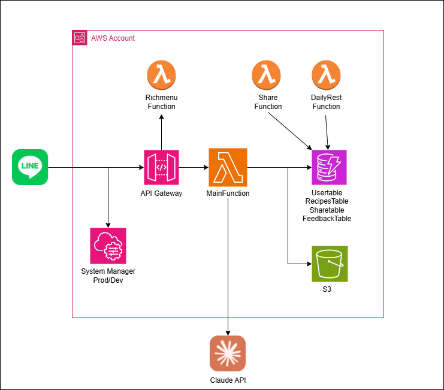

構成図：

## アーキテクチャ設計の意図

この構成は、次の 3 点を重視して考えました。

- 構成をなるべくシンプルに保ちつつ、後から機能を増やせる拡張性
- AWS 無料枠で収めるコスト意識
- セキュリティや環境分離を最低限担保すること

LINE Bot という特性上、ユーザーからのリクエストは突発的であり、なおかつ手軽さが重要になるため、Lambda 中心のサーバーレス構成を選びました。

## 構成概要

- LINE Bot：ユーザーとのインターフェース
- API Gateway：Webhook エンドポイント
- Lambda：すべての処理をここで実行（MVP なので関数は 1 つ）
- DynamoDB：ユーザー情報、紹介コードなどを保存
- S3：食材画像の一時保存
- Claude API：レシピ生成のための外部サービス
- SSM Parameter Store：環境変数やシークレット管理

## サーバーレスを採用した理由

主に 3 つあります。

1. 個人開発なので、インフラ保守の負担を減らしたかった
2. AWS の無料枠で、Lambda・DynamoDB・S3 をうまく組み合わせればかなり低コストで動かせる
3. ステートレスな構成にしておけば、後から機能ごとに Lambda を分けたり、API を追加することも難しくない

## 開発初期に設けた割り切りと工夫

- Lambda 関数は 1 つにまとめて処理（デプロイが簡単、動くものを早く見せたかった）
- IaC は SAM で統一（本番とステージングの環境は SSM で切り替え）
- ログは CloudWatch のみ（今は十分）
- Claude API のレスポンスや制限はまだ未知な部分が多く、処理時間に余裕を持たせた構成

## 今後の拡張を見越したポイント

- Lambda の処理は `app.py` に集約しつつ、処理ごとに `recipe.py`, `user.py`, `share.py` に分離
- DynamoDB には GSI を用意し、紹介制度のような用途にも対応
- S3 にはライフサイクル設定を入れてコストを抑える設計

## 最後に

とにかく動くものを早く作って、かつ後から困らないようにというバランスを意識しました。
完璧な構成ではないですが、自分が現時点で一番納得できる形にはしてあります。
