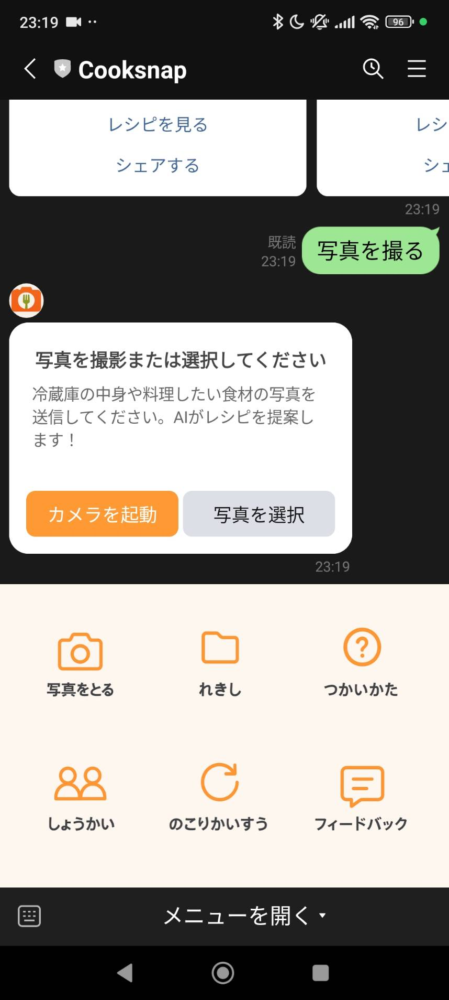

# ui-demo/quick_guide.md

## Cooksnap 簡単ガイド

このドキュメントでは、Cooksnap の基本的な使い方を画像付きで紹介します。
ユーザーにとって迷わず使える UI にするために、構成・ボタン配置・応答内容などを意識して設計しました。

---

## 写真のアップロード画面

<table><tr>
<td></td>
<td>
- 「カメラ起動」または「写真を選択」でアップロード 
- 冷蔵庫の中身を撮るだけでOK
</td>
</tr></table>

## レシピの受け取り方

<table><tr>
<td>
1. LINEで「写真をとる」ボタンをタップ 
2. 食材の写真を送信 
3. 数十秒後、AIが自動でレシピを提案 
 
- 材料・手順・調理時間が含まれる 
- 「シェアする」でSNS共有も可能
</td>
<td></td>
</tr></table>

## 過去のレシピを見る

<table><tr>
<td></td>
<td>
- 「れきし」から過去のレシピを確認できます 
- 食材名・日付・内容の一覧表示あり
</td>
</tr></table>

## 紹介機能について

<table><tr>
<td>
友達を紹介すると利用回数が増えます。 
- 紹介コードが自動で表示される 
- 「LINEで友達に送る」ボタンで簡単に紹介
</td>
<td></td>
</tr></table>

## 利用回数の確認方法

<table><tr>
<td></td>
<td>
- 毎日5回まで無料で利用できます 
- 残り回数、累計利用回数、紹介人数が表示されます 
- 紹介することで追加回数が得られます
</td>
</tr></table>

## フィードバック機能

<table><tr>

<td>
- 「フィードバック」ボタンで意見や感想を送信 
- 「終了」と入力すれば終了できます
</td>
<td></td>
</tr></table>
